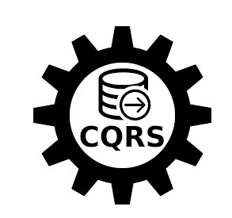

# 🌟 .NET Tabanlı Uygulama

.NET teknolojisiyle geliştirilmiş bir uygulama. Projede **Onion Architecture**, **CQRS**, **MediatR**, **JWT Token** ve **Redis** gibi modern yazılım mimarileri ve araçlar kullanılmaktadır.

 <!-- Banner resmi buraya eklenecek -->

---

## 📖 Proje Açıklaması

Bu proje, **Onion Architecture** prensibi ile katmanlı bir yapıda geliştirilmiştir. Komut ve sorgu operasyonları **CQRS** ile ayrılmıştır, kimlik doğrulama **JWT Token** ile yapılmaktadır, ve performans optimizasyonu için **Redis** kullanılmaktadır.

---

## 🚀 Kullanılan Teknolojiler

| Teknoloji         | Açıklama                                              | 
| ----------------- | ----------------------------------------------------  |
 | **.NET 8**: Backend geliştirme platformu
|  | **.NET 8**: Backend geliştirme platformu |
|  | **.NET 8**: Backend geliştirme platformu    |
|  | **.NET 8**: Backend geliştirme platformu |
|  | **.NET 8**: Backend geliştirme platformu      |
| | **.NET 8**: Backend geliştirme platformu      |
|  | **.NET 8**: Backend geliştirme platformu |
|  | **.NET 8**: Backend geliştirme platformu  |

---

## 📂 Proje Yapısı

 <!-- Proje mimarisi diyagramı -->

Proje, aşağıdaki katmanlara ayrılmıştır:

- **Core**: İş kuralları ve veri modelleri.
- **Application**: CQRS ve servis sınıfları.
- **Infrastructure**: Veri erişimi, Redis gibi dış bağımlılıklar.
- **API**: Web API ve controller'lar.

---

## ⚙️ Kurulum

Projeyi kendi ortamınızda çalıştırmak için:

1. **Projeyi Klonlayın:**

   ```bash
   git clone https://github.com/kullanici-adi/proje-adi.git
   cd proje-adi
